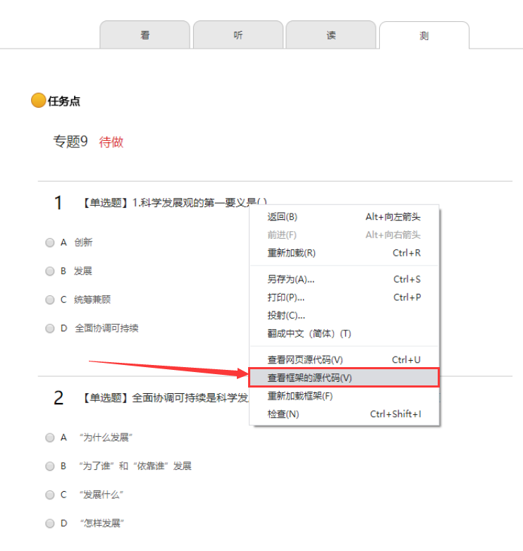

# 超星学习通搜题程序

## 1 多题搜索模式

（1）	打开超星学习通“学生学习页面”，在任意一道题目上方单击右键，点击“查看框架的源代码”。

（2）	在新打开的页面中，“Ctrl + A”全选框架源代码，并放入“超星学习通搜题”程序的输入框内。

（3）粘贴网页源代码如下图。点击“搜题”即可搜索。

（4）其中“Q”代表匹配出的题目，“A”是正确答案。

## 2 单题搜索模式

（1）在输入框输入要搜索的题目的文字部分（注意不能加“【】”和“（）”）。

（2）如下图，点击“搜题”即可搜索。

## 3 其他功能

### 保持最前端功能

点击右下角的“图钉”图标，即可切换“保持最前端”和“取消最前端”
